# RPG Maker Unite のインストール

👇 以下の３つをインストールする

* `Visual Studio`
* `Unity`
* `RPG Maker Unite (RMU)`

`Visual Studio` は、 RPG ツクールだけを使い、 Unity を使わないような読者には不要だが、  
本書を読むような読者には 必要  

## Visual Studio 側

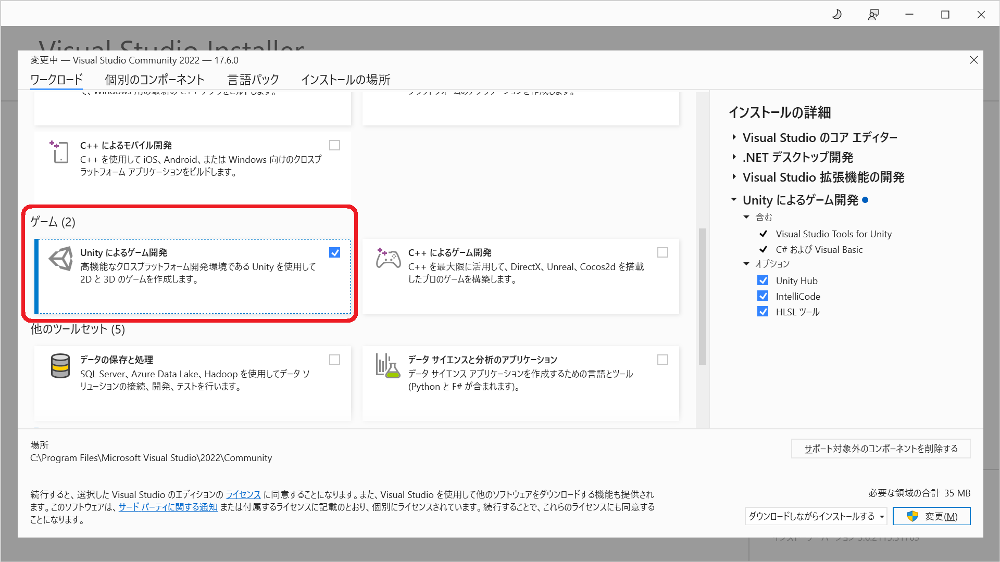  

`Unity によるゲーム開発` を入れる  

## Unity 側

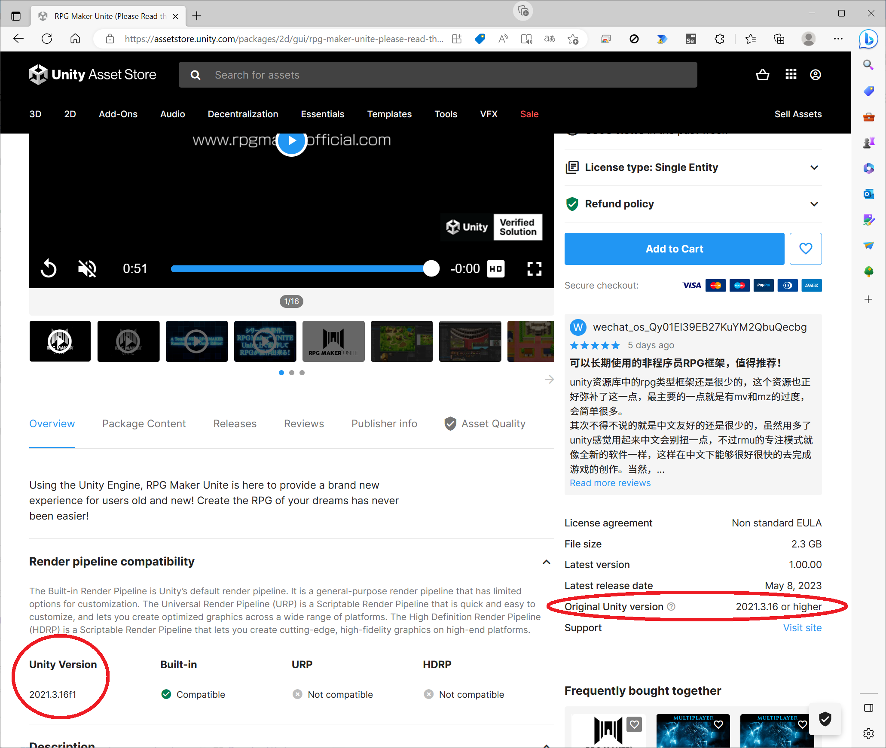  

* 👆 Original unity version を調べる。最新の情報を探してほしい。買うところには書いてあるだろう  

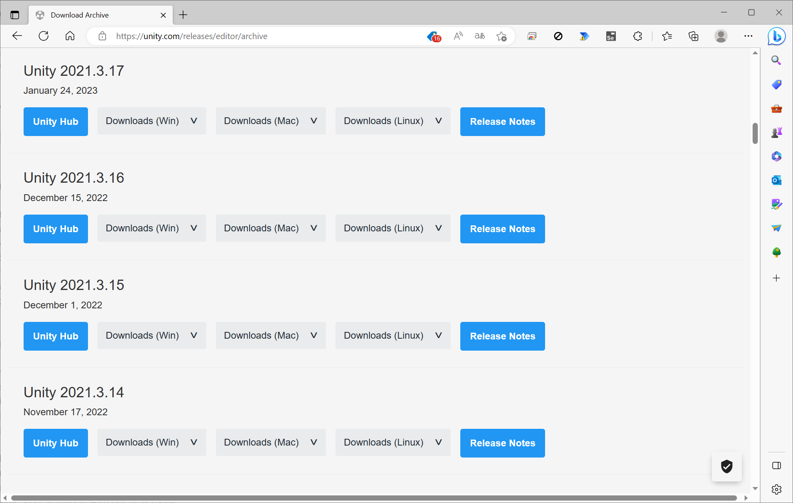  

* 👆 もし Unity のバージョンを `Unity 2021.3.16f` に合わせたいなら、以下のリンク先から入手する  
    📖 [Unity download archive](https://unity.com/releases/editor/archive)

## RMU 側

Unity の新しいプロジェクトを開けておく  

Unity Asset Store で RPG Maker Unite を購入したあと、  

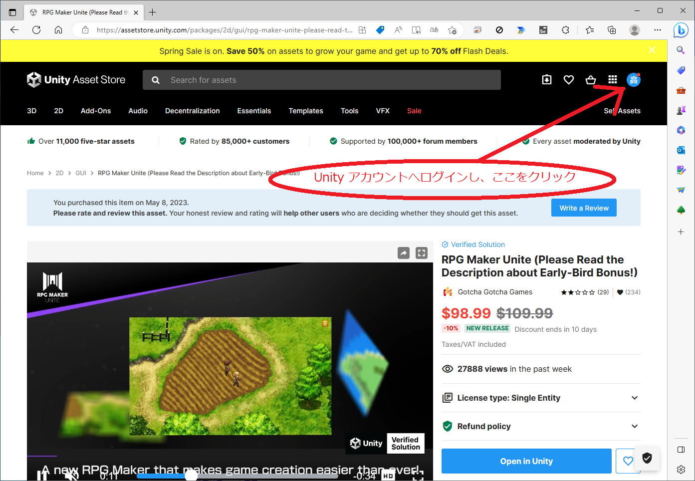  

👆 Unity アカウントへログインし、右上の丸いアイコンをクリック  

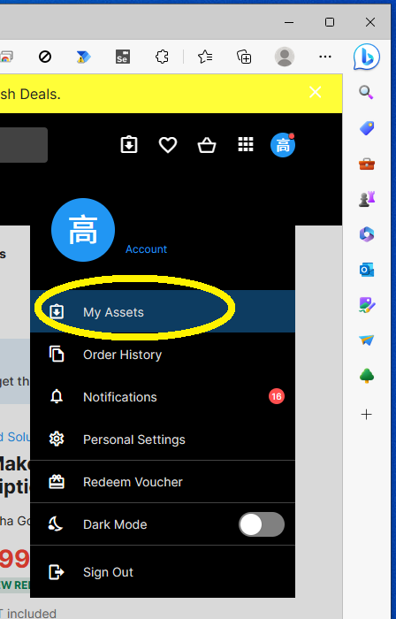

👆 メニューから `My Assets` をクリック  

  

👆 `Open in Unity` ボタンをクリック  

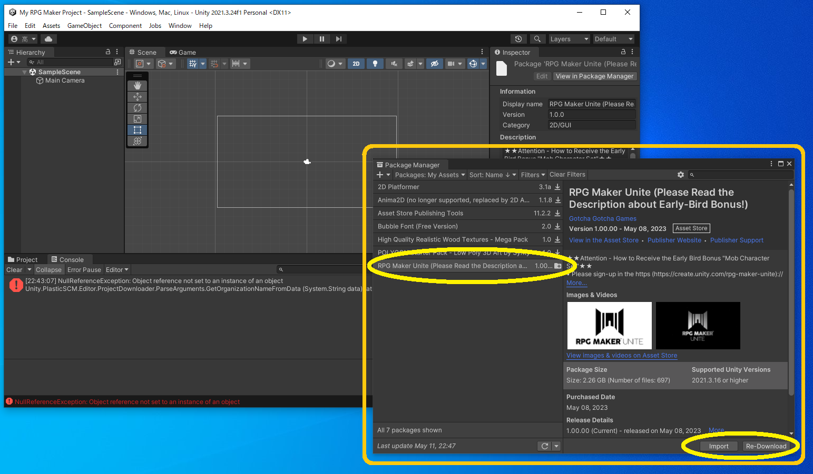  

👆 `Package Manager` が出てくるので、 `RPG Maker Unite` を選択して `Download` ボタンをクリック。  

ダウンロードが終わったら、 `Download` ボタンの横の `Import` ボタンをクリック  

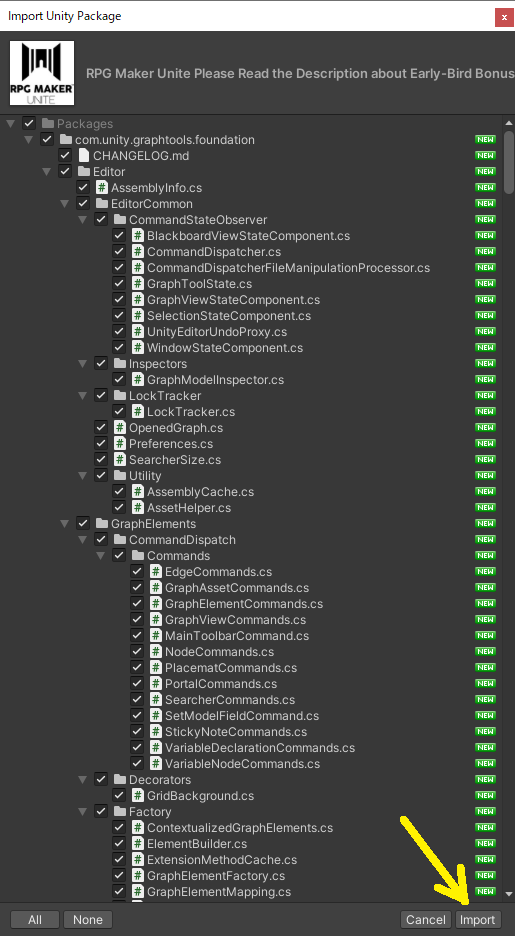  

👆 `Import Unity Package` が出てきたら、 `import` をクリック  

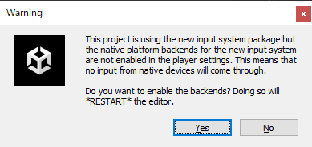  

```plaintext
This project is using the new input system package but
the native platform backends for the new input system
are not enabled in the player settings. This means that
no input from native devices will come through.

Do you want to enable the backends? Doing so will
*RESTART* the editor.
```

```plaintext
このプロジェクトでは、新しい入力システムパッケージを使用していますが
新しい入力システム用のネイティブプラットフォームのバックエンドは
がプレーヤーの設定で有効になっていません。このため
ネイティブデバイスからの入力はありません。

バックエンドを有効にしますか？そうすることで
*エディターを再起動します。
```

👆 この警告が出たら Yes をクリック。 Unity Editor の再起動が進む  

このあと、  

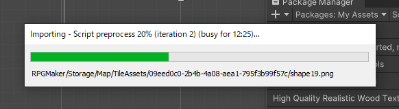  

👆 プログレスバーが出てきて 30分ぐらい待たされる（CPU:Ryzen Threadripper 2920X， GPU:GeForce RTX 4090X，Memory:16GB）  

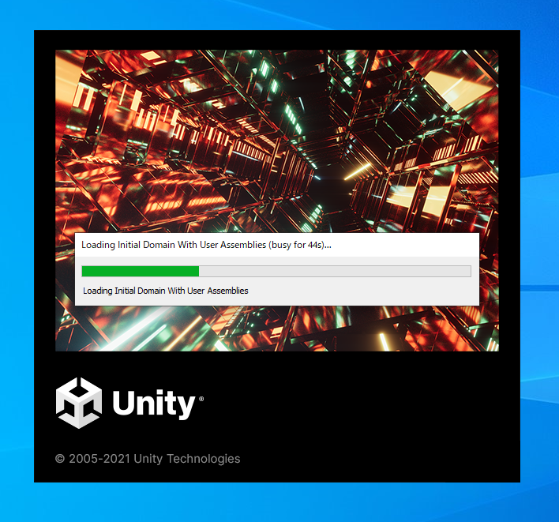  

👆 Unity Editor が突然消えてビックリするが、（30分も経つと再起動していたことを忘れる）Unity Editor が再起動される  

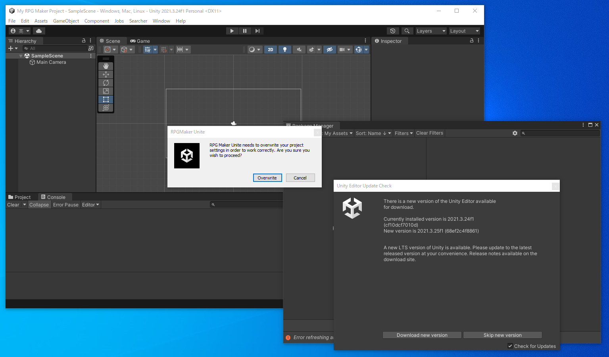  

```plaintext
RPG Maker Unite needs to overwrite your project
settings in order to work correctly. Are you sure you
wish to proceed?
```

```plaintext
RPG Maker Uniteを正しく動作させるためには、プロジェクトの設定を上書きする必要があります。
本当にこのままでよいのでしょうか？
```

👆 `Overwrite` を選ぶ  

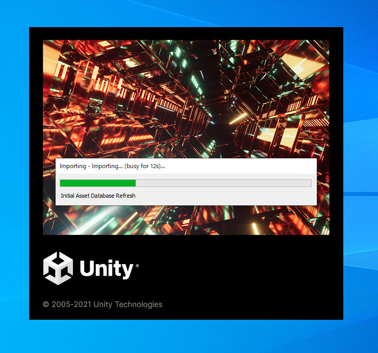  

👆 Unity Editor がまた、再起動する  

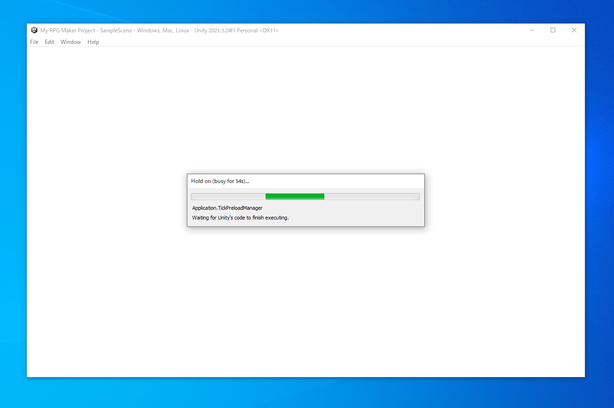  

👆 白いウィンドウが出てきて、またプログレスバーが出てきて待たされる。  
RPG Maker Unite が起動する前には、この「白いウィンドウが出てきて、プログレスバーが出てきて待たされる」を  
必ず通るようだ？  

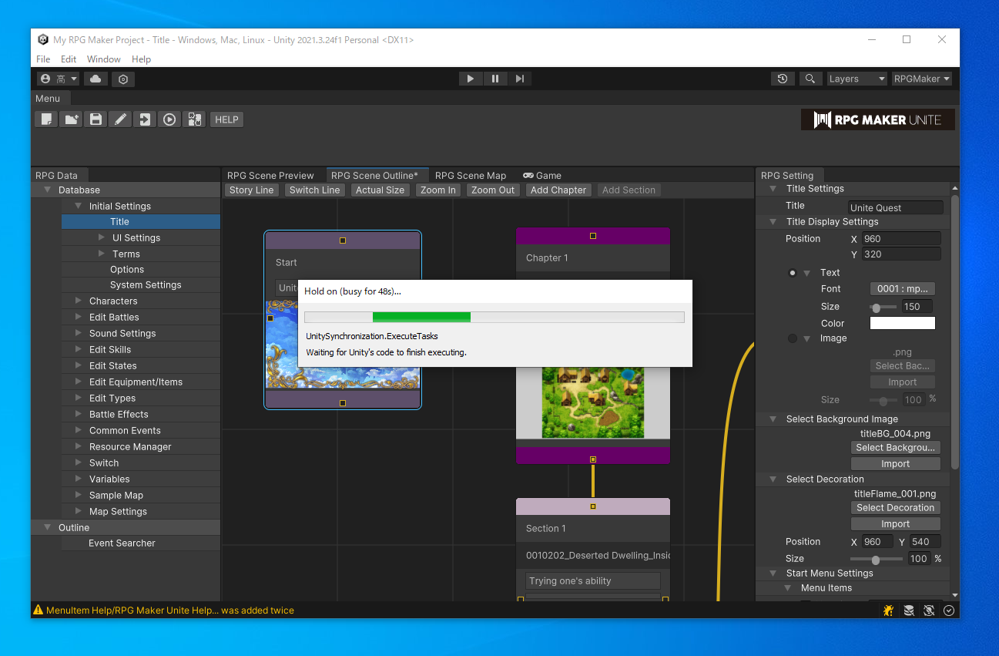  

👆 RPG Maker Unite のエディターが出てくるが、まだプログレスバーは出ていて、待たされる。  
（まだ待ってほしい）  

後ろに アウトライン の画面が出ているが、これはロードの途中にたまたま見えているだけで、  
RPG Maker Unite のエディターの想定したファースト・ビューではないのかもしれない  

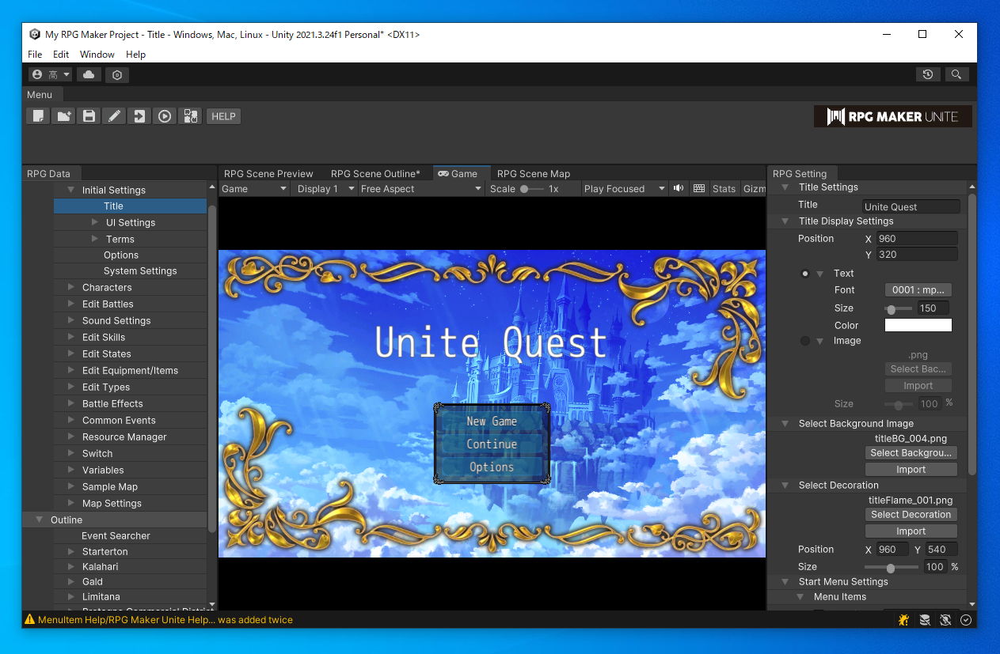  

👆　このサンプル・ゲームのタイトル画面が出てきたら、ロード完了  

🏠[トップページへ戻る](../README.md)  