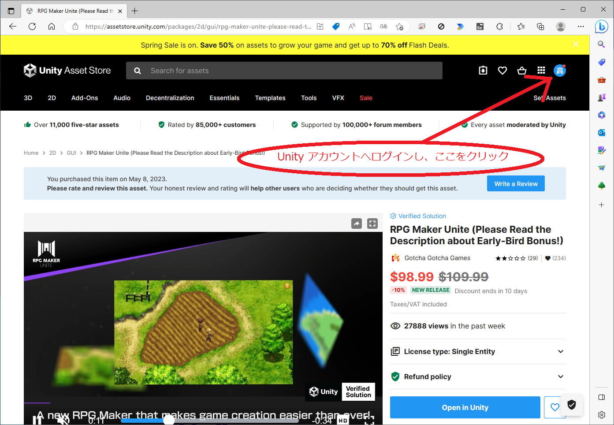
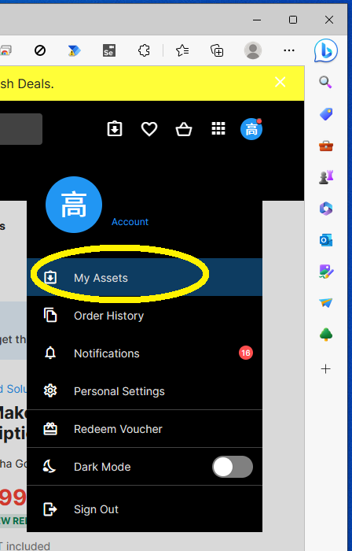
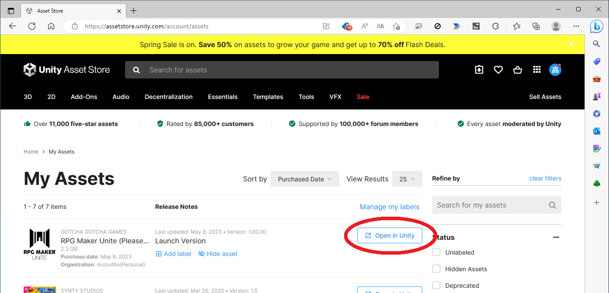
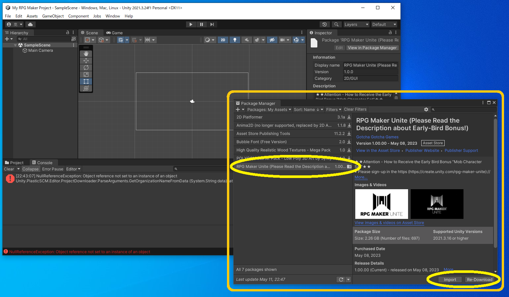

# RPG Maker Unite のインストール

Unity の新しいプロジェクトを開けておく  

Unity Asset Store で RPG Maker Unite を購入したあと、  

  

👆 Unity アカウントへログインし、右上の丸いアイコンをクリック  

👆 メニューから `My Assets` をクリック  

  

👆 `Open in Unity` ボタンをクリック  

  

👆 `Package Manager` が出てくるので、 `RPG Maker Unite` を選択して `Download` ボタンをクリック。  

ダウンロードが終わったら、 `Download` ボタンの横の `Import` ボタンをクリック  
