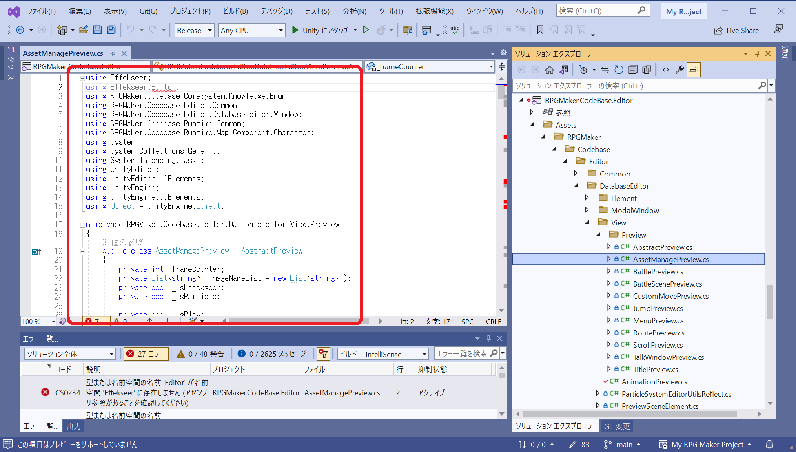

# UNITY_EDITOR プリプロセッサ・ディレクティブの追加（改悪を行う）

## 前提知識

Unity の C# スクリプトは、以下のように大きく２つに分かれる

* `Unity エディター用` - ヒエラルキー・ビューや、インスペクター・ビューを表示してゲームを編集しているときだ
* `それ以外` - ゲーム用。Unity エディターで Play ボタンを押し、ゲームをプレイしているときだ

👇 Unity エディター用では、以下のようにソースコードを `#if UNITY_EDITOR` と `#endif` で囲む

```cs
namespace Apple.Banana.Cherry
{
#if UNITY_EDITOR
    // Unity エディター用のコードをここに書く
#else
    // それ以外のコードをここに書く
#end
    // どちらでも使うコードは、その外へ書く
}
```

👇 なお、 Unity エディターでしか使わない C# スクリプトであれば、 `Editor` という名前のフォルダーの下に置けば  
わざわざ `#if UNITY_EDITOR` と `#endif` で囲む必要はない  

```plaintext
    📁 Assets
👉  └──📁 Editor
        └──📄 Apple.cs      # Unity エディター用の C# スクリプトとみなされる
```

参考: 📖 [Unity Documentation > 特殊なフォルダー名](https://docs.unity3d.com/ja/2019.4/Manual/SpecialFolders.html)  

# 以下の現状は、当然に思える

* `RPGMaker.CodeBase.Editor` プロジェクトのソースコードが、Unity エディター用とそれ以外とに分かれていないこと
* Visual Studio の `Release` モードでビルドするなら、 Unity エディター用の C# スクリプトが含まれないこと

だから、 **Visual Studio** では、 `Release` モードでビルドすると、 Unity エディター用のコードがコンパイルできないことは当然と思えるし  
**Unity** には、 `Editor` フォルダー以外のソースだけを選んでビルドするような仕掛けがあるのだろうと推測する  

## 問題点

👇 Visual Studio 2022 で `Release` モードにし、ビルドすると、  
`RPGMaker.CodeBase.Editor` のような Unity エディター用のソースも含まれているので、  
一緒にビルドされ、エラーが出る  

  

このように `Release` モードでビルドできないなら、 `Release` モードに不具合がないかということを Visual Studio 上で調査できない。  
`Editor` フォルダー以外のソースだけをビルドするような仕掛けは、 Visual Studio でできるだろうか？  

参考: 📄 [Unity Documentation > C# コンパイラー](https://docs.unity3d.com/ja/2020.3/Manual/CSharpCompiler.html)  

## やること

仕方がないので、  
`Editor` という名前のフォルダーの下にあるソースであっても、  
ソースコードを `#if UNITY_EDITOR` と `#endif` で囲めば、 `Release` モードでビルドできるかもしれない。  
試みてみたい  

👇 RMU のソースは以下のような作法になっているから...  

```cs
using DragonFruit.Eggplant.Fig;

namespace Apple.Banana.Cherry
{
    // ここにコードがある
}
```

👇 以下のように書き換える  

```cs
namespace Apple.Banana.Cherry
{
#if UNITY_EDITOR
    using DragonFruit.Eggplant.Fig;

    // ここにコードがある
#end
}
```

🏠[トップページへ戻る](../../README.md)  
