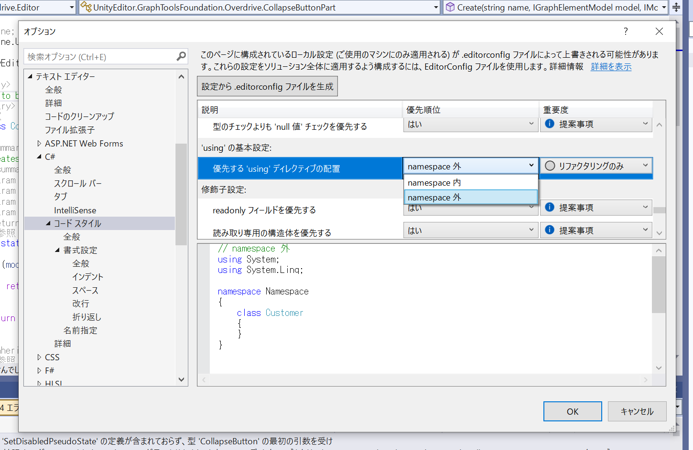
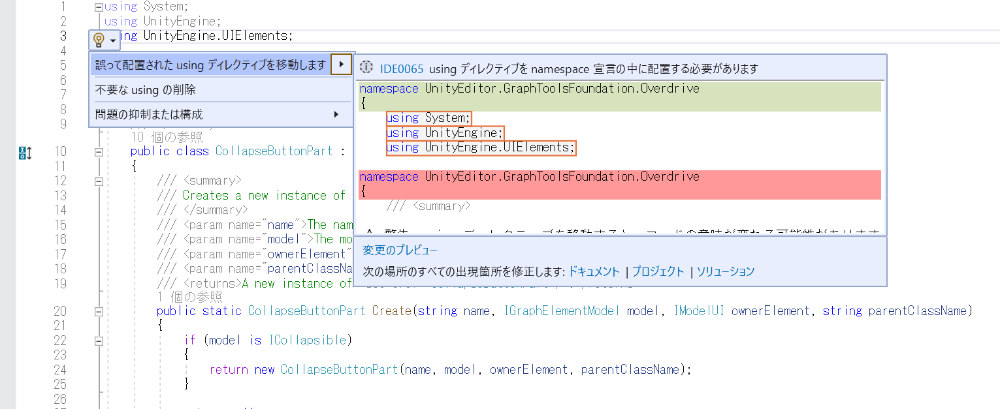
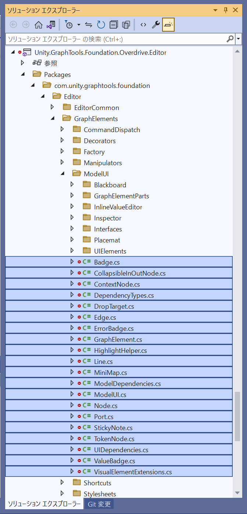
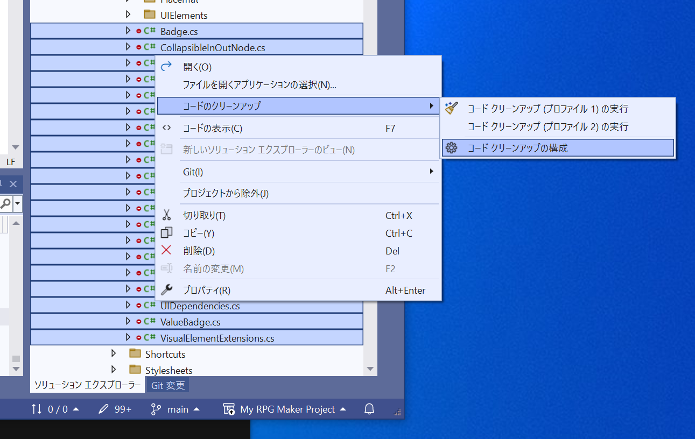
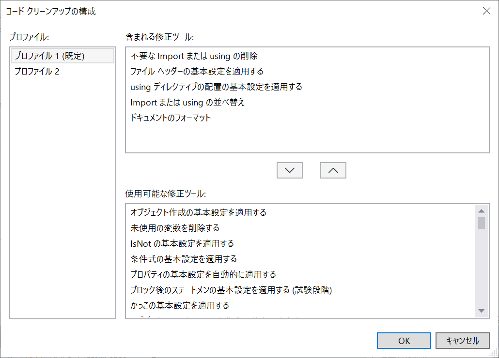
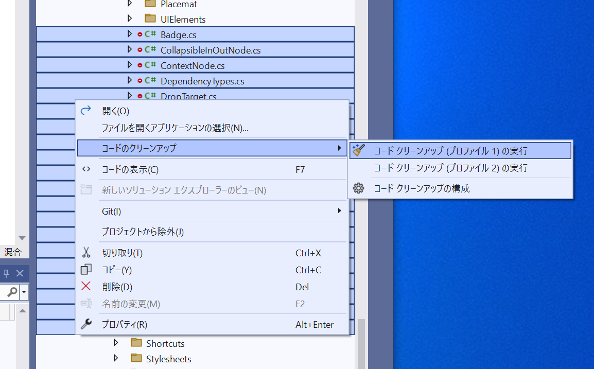

# using ディレクティブは namespace の内側に入れる

👇 Visual Studio の `[ツール] - [オプション] - [テキスト エディター] - [C#] - [コードスタイル] - [全般] - ['using' の基本設定:]` へ進む  

  

👆 `namespace 内` にする  

👇 このあと　ソースコードの豆電球をクリック  

  

しかし、１ファイルずつ　やるのも大変だ。  

  

👆 ファイルを複数選択（Shiftキーを押しながら、選択したいファイルの先頭と末尾をクリック）  

* 多くのファイルを選ぶと処理時間がかかるので、最初は２つ、３つのファイルから始めるのがよい

  

👆 右クリックして `[コードのクリーンアップ] - [コード クリーンアップの構成]` をクリック  

  

👆 下の欄から `using ディレクティブの配置の基本設定を適用する` を選択して `∧` ボタンをクリック  

* 本当はここで、ちゃんと要るもの、要らないものを選んで構成を作ってほしい  
* 慣れないうちは、 `不要な Import または using の削除` は外す方がよい。元に戻す操作がないから

  

👆 右クリックして `[コードのクリーンアップ] - [コード クリーンアップ（プロファイル 1）の実行]` をクリック  
