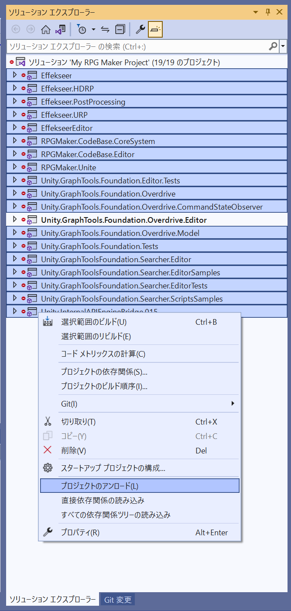
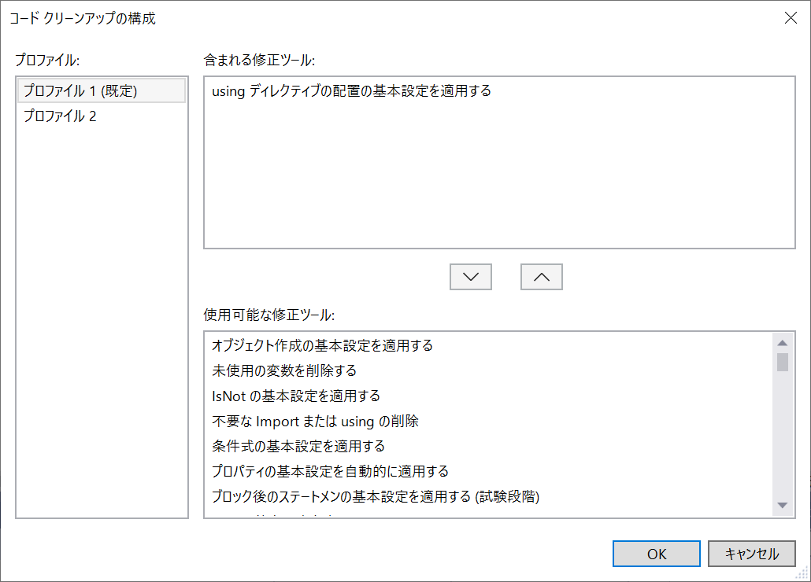

# using ディレクティブは namespace の内側に入れる（趣味）

この章は必須ではない  

## やりたいこと

👇 RMU のソースは以下のような作法になっているから...  

```cs
using DragonFruit.Eggplant.Fig;

namespace Apple.Banana.Cherry
{
    // ここにコードがある
}
```

👇 以下のように書き換える  

```cs
namespace Apple.Banana.Cherry
{
#if UNITY_EDITOR
    using DragonFruit.Eggplant.Fig;

    // ここにコードがある
#end
}
```

## やりかた

👇 Visual Studio の `[ツール] - [オプション] - [テキスト エディター] - [C#] - [コードスタイル] - [全般] - ['using' の基本設定:]` へ進む  

  

👆 `namespace 内` にする  

👇 このあと　ソースコードの豆電球をクリック  

  

しかし、１ファイルずつ　やるのも大変だ。  

## ファイル複数選択

  

👆 関係ないプロジェクトをアンロード  
（リファクタリングのための事前調査がソリューション全体に及んで前処理時間が膨大にかかるので）

  

👆 ファイルを複数選択（Shiftキーを押しながら、選択したいファイルの先頭と末尾をクリック）  

* 最初は１つだけ選び、慣れてきたら少しずつ増やしていけば間違いは少ない  

  

👆 右クリックして `[コードのクリーンアップ] - [コード クリーンアップの構成]` をクリック  

  

👆 下の欄から `using ディレクティブの配置の基本設定を適用する` を選択して `∧` ボタンをクリック  

* 今やりたいことだけを選べば充分だ
* 慣れないうちは、 `不要な Import または using の削除` は外す方がよい。元に戻す操作がないから

  

👆 右クリックして `[コードのクリーンアップ] - [コード クリーンアップ（プロファイル 1）の実行]` をクリック  
