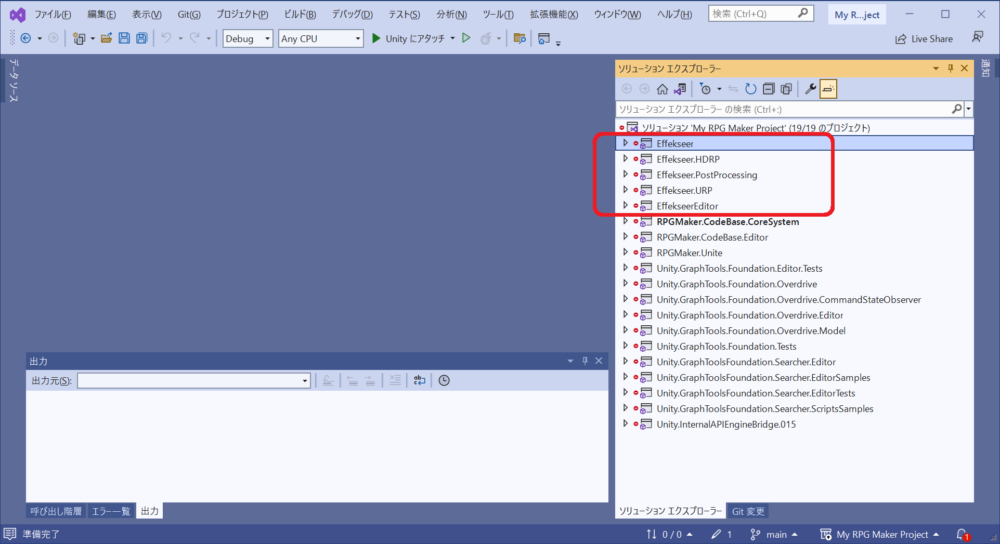
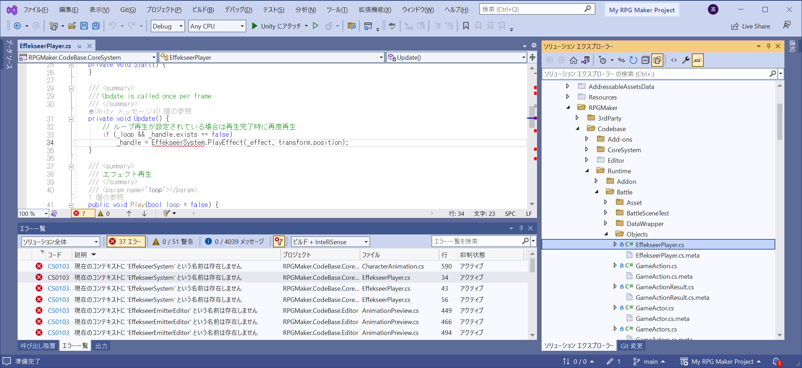
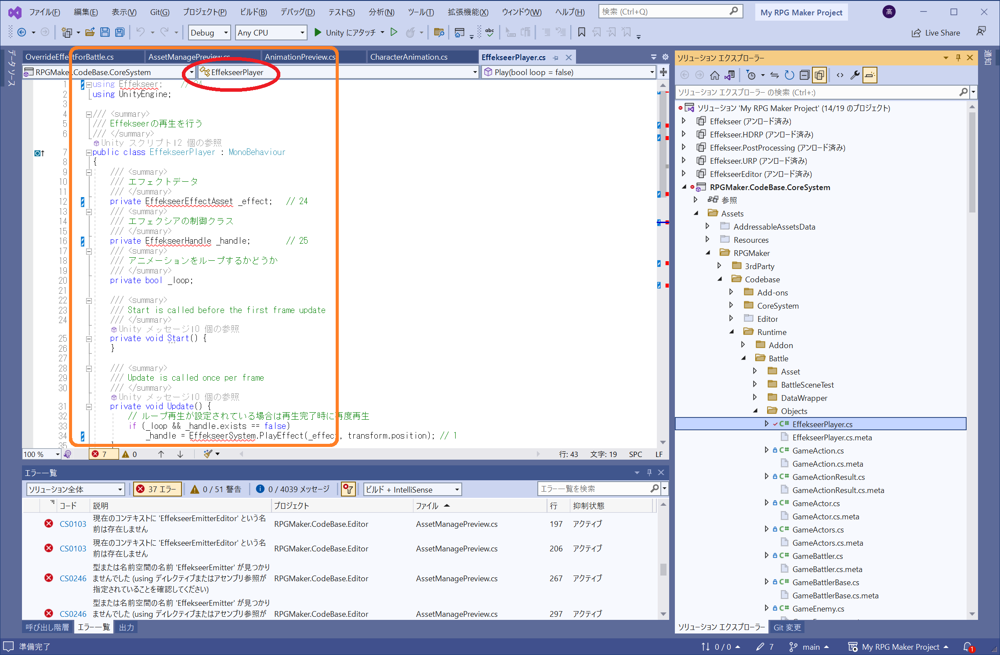
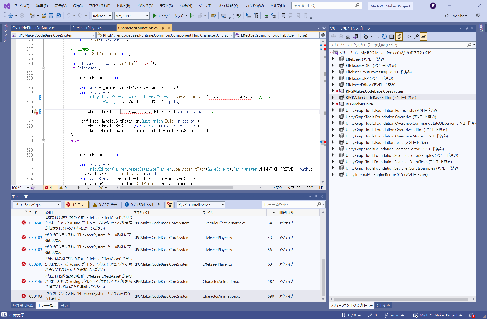

# 調査：　一連の Effekseer プロジェクト

  

👆 `Effekseer` は消していいという話しもツイッターに流れている。  
消していいものが　なぜ　ここにあるのだろう？　調べていく  

  

👆 Debug モードで 37個のエラーが出てきた。 消していいものではない気がするが……  

## RPGMaker.Codebase.Editor.Inspector.Animation.View.AnimationInspectorElement

```
    📞 33
    using Effekseer;    // 33
    ↑
    RPGMaker.Codebase.Editor.Inspector.Animation.View.AnimationInspectorElement
    ファイル冒頭
```

```
    📞 37
        var effekseer = AssetDatabase.LoadAssetAtPath<EffekseerEffectAsset>(PathManager.ANIMATION_EFFEKSEER + path);    // 37
    ↑
    RPGMaker.Codebase.Editor.Inspector.Animation.View.AnimationInspectorElement
    private static void EffectPreview(
            RPGMaker.Codebase.Editor.DatabaseEditor.View.Preview.AnimationPreview sceneView,
            List<AssetManageDataModel> manageDatas,
            AssetManageDataModel assetManageData,
            AnimationDataModel animationDataModel)
```

## RPGMaker.Codebase.Editor.DatabaseEditor.View.Preview.AnimationPreview

```
    📞 29, 30
    using Effekseer;            // 29
    using Effekseer.Editor;     // 30
    ↑
    RPGMaker.Codebase.Editor.DatabaseEditor.View.Preview.AnimationPreview
    ファイル冒頭
```

```
    📞 20
    // 『再生』ボタン。
    _effekseer?.GetComponent<EffekseerEmitter>()?.effectAsset == null      // 20
    ↑
    RPGMaker.Codebase.Editor.DatabaseEditor.View.Preview.AnimationPreview
    new public VisualElement CreateUi()
```

```
    📞 21
    _effekseer.GetComponent<EffekseerEmitter>().speed = rate * 0.01f       // 21
    ↑
    RPGMaker.Codebase.Editor.DatabaseEditor.View.Preview.AnimationPreview
    public void ChangeSpeed(float rate)
```

```
    📞 16, 17, 18
    // Effekseer初期化
    EffekseerEditor.instance.InitSystem(); // 16
    _effekseer.GetComponent<EffekseerEmitter>().effectAsset = prefab as EffekseerEffectAsset;   // 17, 18
    ↑
    RPGMaker.Codebase.Editor.DatabaseEditor.View.Preview.AnimationPreview
    public void ChangeParticle<T>(T prefab, bool effekseer)
```

```
    📞 5
    EffekseerEmitterEditor.GetInstance()?.IsExists() == false
    ↑
    RPGMaker.Codebase.Editor.DatabaseEditor.View.Preview.AnimationPreview
    private bool IsPlay()
```

```
    📞 6
    EffekseerEmitterEditor.GetInstance()?.Play();
    ↑
    RPGMaker.Codebase.Editor.DatabaseEditor.View.Preview.AnimationPreview
    private void PlayPaticle()
```

```
    📞 7
    EffekseerEmitterEditor.GetInstance()?.Stop();
    ↑
    RPGMaker.Codebase.Editor.DatabaseEditor.View.Preview.AnimationPreview
    private void SimulateDisable()
```

## RPGMaker.Codebase.Editor.DatabaseEditor.View.Preview

```
    📞 31, 32
    using Effekseer;            // 31
    using Effekseer.Editor;     // 32
    ↑
    RPGMaker.Codebase.Editor.DatabaseEditor.View.Preview
    ファイル冒頭
```

```
    📞 8, 9, 10, 11
    var effect =
        AssetDatabase.LoadAssetAtPath<EffekseerEffectAsset>(_particlePath); // 8
    var obj = new GameObject();
    obj.AddComponent<EffekseerEmitter>().effectAsset = effect; // 9
    _particleObj = obj;
    EffekseerEmitterEditor.GetInstance()?.Stop(); // 10
    EffekseerEditor.instance.InitSystem(); // 11
    ↑
    RPGMaker.Codebase.Editor.DatabaseEditor.View.Preview.AssetManagePreview
    public override void InitUi(SceneWindow sceneWindow, bool isChange = false)
```

```
    📞 12, 13
    EffekseerEmitterEditor.GetInstance()?.IsExists() == false   // 12
    EffekseerEmitterEditor.GetInstance().Stop();    // 13
    ↑
    RPGMaker.Codebase.Editor.DatabaseEditor.View.Preview.AssetManagePreview
    // 更新処理
    public override void Update()
```

```
    📞 14, 15
    EffekseerEmitterEditor.GetInstance().Play();    // 14
    EffekseerEmitterEditor.GetInstance().Stop();    // 15
    ↑
    RPGMaker.Codebase.Editor.DatabaseEditor.View.Preview.AssetManagePreview
    // UI作成
    public override VisualElement CreateUi()
```

```
    📞 22
    _particleObj.GetComponentInChildren<EffekseerEmitter>().Play();     // 22
    ↑
    RPGMaker.Codebase.Editor.DatabaseEditor.View.Preview.AssetManagePreview
    // エフェクト再生
    public void PlayPaticle()
```

```
    📞 23
    _particleObj.GetComponentInChildren<EffekseerEmitter>().Stop();     // 23
    ↑
    RPGMaker.Codebase.Editor.DatabaseEditor.View.Preview.AssetManagePreview
    // パーティクルのシミュレート設定を無効化
    public void SimulateDisable()
```

## RPGMaker.Codebase.Runtime.Common.Component.Hud.Character.CharacterAnimation

```
    📞 27
    using Effekseer;    // 27
    ↑
    RPGMaker.Codebase.Runtime.Common.Component.Hud.Character.CharacterAnimation
    ファイル冒頭
```

```
    📞 19
    RPGMaker.Codebase.Runtime.Common.Component.Hud.Character.CharacterAnimation
    クラスのプロパティ
    private EffekseerHandle _effekseerHandle; // 19
    ↑
```

```
    📞 35
    var particle =
        UnityEditorWrapper.AssetDatabaseWrapper.LoadAssetAtPath<EffekseerEffectAsset>(  // 35
            PathManager.ANIMATION_EFFEKSEER + path);
    ↑
    ↑
    RPGMaker.Codebase.Runtime.Common.Component.Hud.Character.CharacterAnimation
    // パーティクルの設定（Effekseerか、Unityか）
    private void EffectSet(
        string id,
        bool isBattle = false)
```

```
    📞 4
    _effekseerHandle = EffekseerSystem.PlayEffect(particle, pos);
    ↑
    RPGMaker.Codebase.Runtime.Common.Component.Hud.Character.CharacterAnimation
    // パーティクルの設定（Effekseerか、Unityか）
    private void EffectSet(
        string id,
        bool isBattle = false)
```

## （ネームスペース無し）.EffekseerPlayer

```
    📞 34
    using Effekseer;    // 34
    ↑
    （ネームスペース無し）.EffekseerPlayer
    ファイル冒頭
```

```
    📞 24, 25
    クラスのプロパティ
    /// <summary>
    /// エフェクトデータ
    /// </summary>
    private EffekseerEffectAsset _effect;   // 24
    /// <summary>
    /// エフェクシアの制御クラス
    /// </summary>
    private EffekseerHandle _handle;        // 25
    ↑
    （ネームスペース無し）.EffekseerPlayer
```

```
    📞 1
    // ループ再生が設定されている場合は再生完了時に再度再生
    _handle = EffekseerSystem.PlayEffect(_effect, transform.position);
    ↑
    （ネームスペース無し）.EffekseerPlayer
    // Update is called once per frame
    private void Update()
```

```
    📞 2
    // transformの位置でエフェクトを再生する
    _handle = EffekseerSystem.PlayEffect(_effect, transform.position);
    ↑
    （ネームスペース無し）.EffekseerPlayer
    // エフェクト再生
    public void Play(bool loop = false)
```

```
    📞 3
    EffekseerSystem.StopAllEffects();
    ↑
    （ネームスペース無し）.EffekseerPlayer
    // エフェクト停止
    public void Stop()
```

```
    📞 36
    // エフェクトデータ設定
    public void SetEffectData(EffekseerEffectAsset asset)   // 36
    ↑
    （ネームスペース無し）.EffekseerPlayer
```

## RPGMaker.Codebase.Runtime.Common.OverrideEffectForBattle


```
    📞 28
    using Effekseer;        // 28
    ↑
    RPGMaker.Codebase.Runtime.Common.OverrideEffectForBattle
    ファイル冒頭
```

```
    📞 26
    var effect = UnityEditorWrapper.AssetDatabaseWrapper.LoadAssetAtPath<EffekseerEffectAsset>(     // 26
        "Assets/RPGMaker/Storage/Animation/Effekseer" + "/" + name);
    ↑
    RPGMaker.Codebase.Runtime.Common.OverrideEffectForBattle
    // Sprite設定処理
    public void SetSprite(string name) {
```

## まとめ

これだけ使っているなら、削除すると プログラムはコンパイルできなくなると思うが……  

  

👆 このクラスはなんで　ネームスペースが無いのだろうか？  

  

👆 リリース・モードでもビルドしてみたが、デバッグ・モードで確認した箇所で足りていた  
