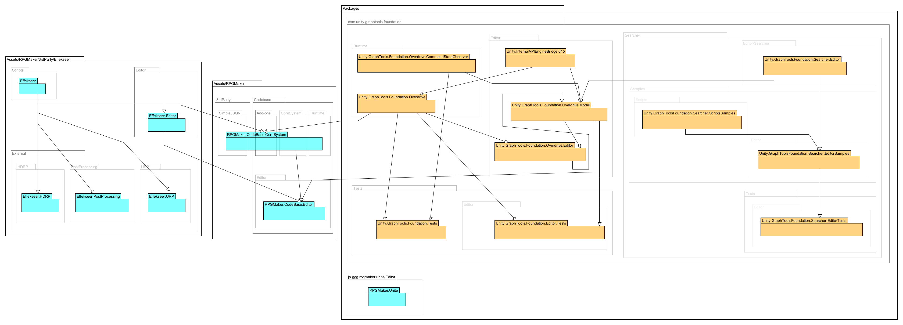
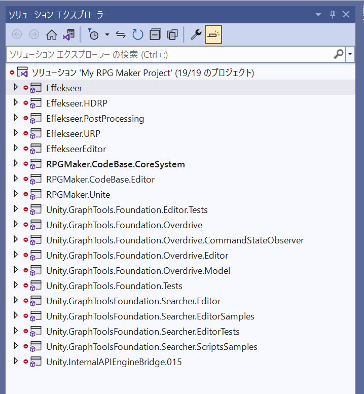
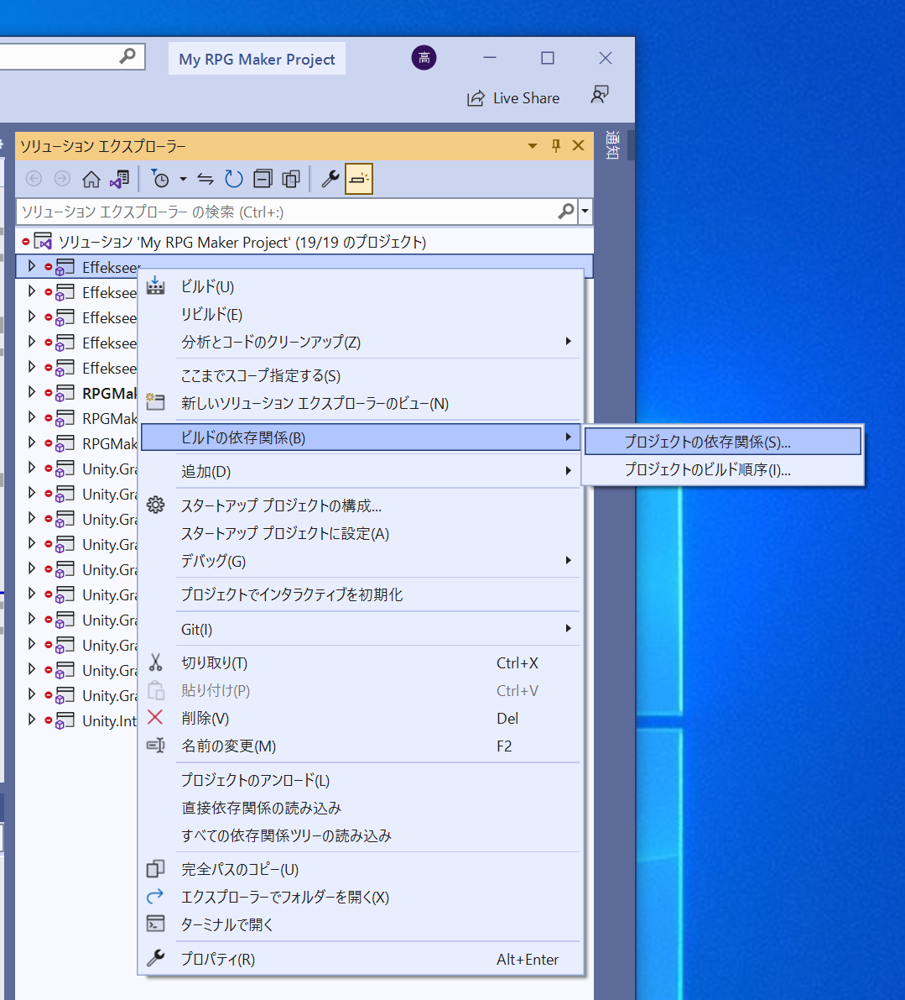
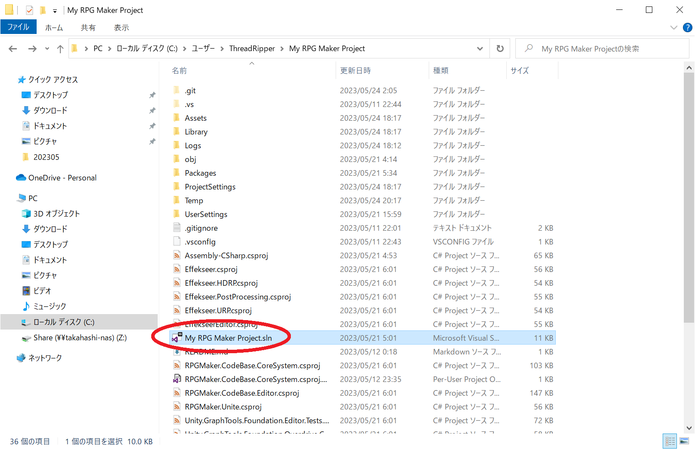
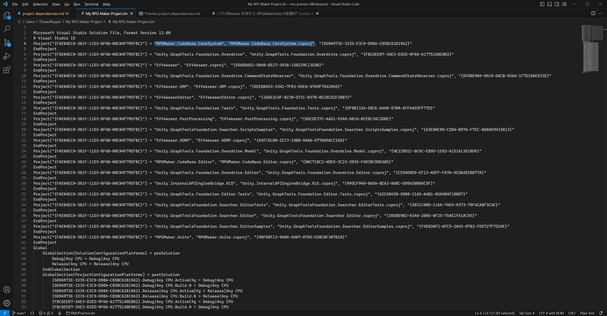
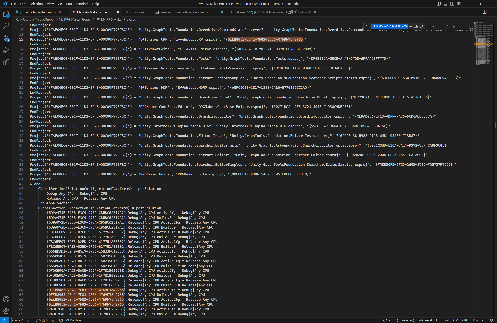
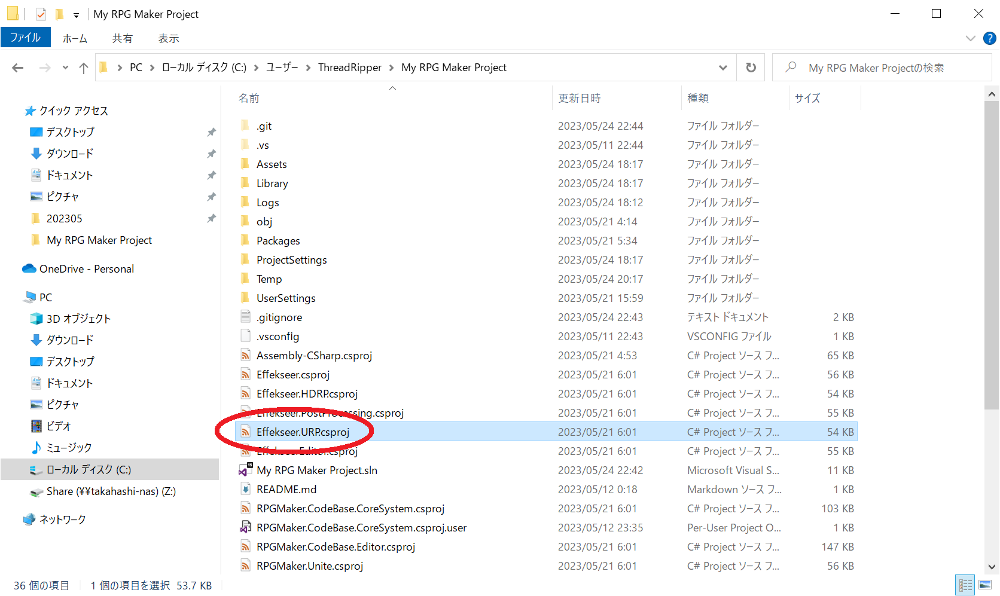
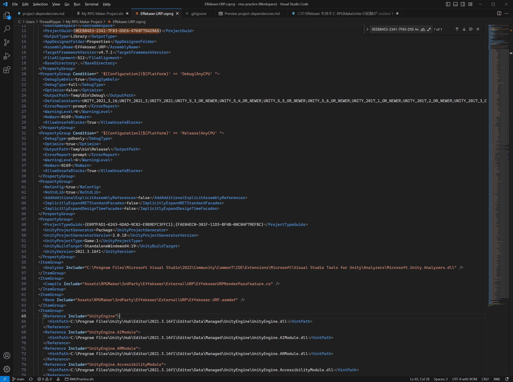
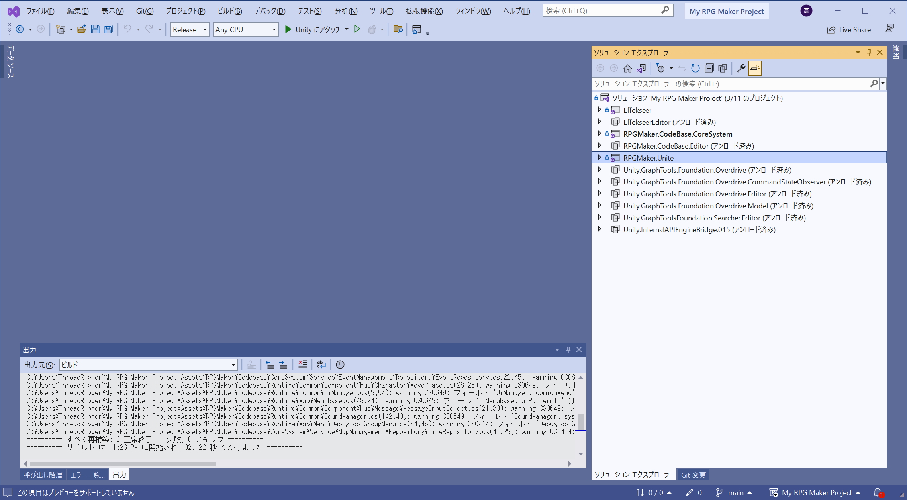
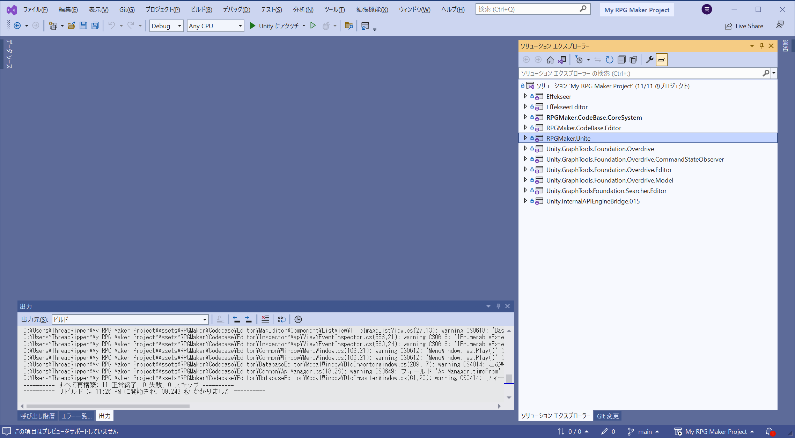

# プロジェクトの依存関係

## 図

  

作図ソフト： 📖 [UMLet 15.1](https://www.umlet.com/)  

## プロジェクト一覧

  

👆 プロジェクトはこれだけある  

* Effekseer
* Effekseer.HDRP
* Effekseer.PostProcessing
* Effekseer.URP
* EffekseerEditor
* RPGMaker.CodeBase.CoreSystem
* RPGMaker.CodeBase.Editor
* RPGMaker.Unite
* Unity.GraphTools.Foundation.Editor.Tests
* Unity.GraphTools.Foundation.Overdrive
* Unity.GraphTools.Foundation.Overdrive.CommandStateObserver
* Unity.GraphTools.Foundation.Overdrive.Editor
* Unity.GraphTools.Foundation.Overdrive.Model
* Unity.GraphTools.Foundation.Tests
* Unity.GraphToolsFoundation.Searcher.Editor
* Unity.GraphToolsFoundation.Searcher.EditorSamples
* Unity.GraphToolsFoundation.Searcher.EditorTests
* Unity.GraphToolsFoundation.Searcher.ScriptsSamples
* Unity.InternalAPIEngineBridge.015

## 依存関係

  

👆 プロジェクトの依存関係を見ていこう

* Effekseer
    * 主なし
* Effekseer.HDRP
    * Effekseer
* Effekseer.PostProcessing
    * Effekseer
* Effekseer.URP
    * Effekseer
* EffekseerEditor
    * Effekseer
* RPGMaker.CodeBase.CoreSystem
    * Effekseer
    * Unity.GraphTools.Foundation.Overdrive
* RPGMaker.CodeBase.Editor
    * Effekseer
    * EffekseerEditor
    * RPGMaker.CodeBase.CoreSystem
    * Unity.GraphTools.Foundation.Overdrive
    * Unity.GraphTools.Foundation.Overdrive.CommandStateObserver
    * Unity.GraphTools.Foundation.Overdrive.Editor
    * Unity.GraphTools.Foundation.Overdrive.Model
* RPGMaker.Unite
    * 主なし
* Unity.GraphTools.Foundation.Editor.Tests
    * Unity.GraphTools.Foundation.Overdrive
    * Unity.GraphTools.Foundation.Overdrive.CommandStateObserver
    * Unity.GraphTools.Foundation.Overdrive.Editor
    * Unity.GraphTools.Foundation.Overdrive.Model
    * Unity.GraphToolsFoundation.Searcher.Editor
    * Unity.InternalAPIEngineBridge.015
* Unity.GraphTools.Foundation.Overdrive
    * Unity.InternalAPIEngineBridge.015
* Unity.GraphTools.Foundation.Overdrive.CommandStateObserver
    * 主なし
* Unity.GraphTools.Foundation.Overdrive.Editor
    * Unity.GraphTools.Foundation.Overdrive
    * Unity.GraphTools.Foundation.Overdrive.CommandStateObserver
    * Unity.GraphTools.Foundation.Overdrive.Model
    * Unity.GraphToolsFoundation.Searcher.Editor
    * Unity.InternalAPIEngineBridge.015
* Unity.GraphTools.Foundation.Overdrive.Model
    * Unity.GraphTools.Foundation.Overdrive.CommandStateObserver
    * Unity.GraphTools.Foundation.Overdrive.Editor
    * Unity.GraphToolsFoundation.Searcher.Editor
    * Unity.InternalAPIEngineBridge.015
* Unity.GraphTools.Foundation.Tests
    * Unity.GraphTools.Foundation.Overdrive
    * Unity.GraphTools.Foundation.Overdrive.CommandStateObserver
    * Unity.InternalAPIEngineBridge.015
* Unity.GraphToolsFoundation.Searcher.Editor
    * 主なし
* Unity.GraphToolsFoundation.Searcher.EditorSamples
    * Unity.GraphToolsFoundation.Searcher.Editor
    * Unity.GraphToolsFoundation.Searcher.ScriptsSamples
* Unity.GraphToolsFoundation.Searcher.EditorTests
    * Unity.GraphToolsFoundation.Searcher.Editor
    * Unity.GraphToolsFoundation.Searcher.EditorSamples
* Unity.GraphToolsFoundation.Searcher.ScriptsSamples
    * 主なし
* Unity.InternalAPIEngineBridge.015
    * 主なし

👆 これを図にすれば、ネットワーク図になっているはずだ。見てみよう  


```
                                                                                                                                                                                                        ┌────────────────┐
                                                                                                                                                                                                        │ RPGMaker.Unite │★要る
                                                                                                                                                                                                        └────────────────┘                    
                                                                                                                                                                                                        ┌───────────────┐
                   ┌────────────────────────────────────────────────────────────────────────────────────────────────────────────────────────────────────────────────────────────────────────────────────┤ Effekseer.URP │
                   │                                                                                                                                                                                    └───────────────┘
                   ↓                                                                                                                                                                                    ┌──────────────────────────┐
                   ├────────────────────────────────────────────────────────────────────────────────────────────────────────────────────────────────────────────────────────────────────────────────────┤ Effekseer.PostProcessing │
                   │                                                                                                                                                                                    └──────────────────────────┘
                   ↓                                                                                                                                                                                    ┌────────────────┐
                   ├────────────────────────────────────────────────────────────────────────────────────────────────────────────────────────────────────────────────────────────────────────────────────┤ Effekseer.HDRP │
                   │                                                                                                                                                                                    └────────────────┘
                   ↓                                                                                                                        ┌─────────────────┐
                   ├────────────────────────────────────────────────────────────────────────────────────────────────────────────────────────┤ EffekseerEditor ├←────────────────────────────────────┐
                   │                                                                                                                        └─────────────────┘                                     │
                   ↓                                                                                                                                                                                │
                   ├───────────────────────────────────────────────────────────────────────────────────────────────────────────────┐                                                                │   ┌──────────────────────────┐
┌───────────┐      │                                                                                                               │                                                                ├───┤ RPGMaker.CodeBase.Editor │★要る
│ Effekseer ├←─────┘                                                                                                               │                                                                │   └──────────────────────────┘
└───────────┘                                                                                                                      │                                                                │
                                                                                                                                   │        ┌──────────────────────────────┐                        │
                                                                                                                                   ├────────┤ RPGMaker.CodeBase.CoreSystem ├←───────────────────────┤
                                                                                                                                   │        └──────────────────────────────┘                        │
                                                                                                                                   │                                                                │
┌───────────────────────────────────┐                                  ┌───────────────────────────────────────┐                   │                                                                │
│ Unity.InternalAPIEngineBridge.015 ├←─────────────────────────────────┤ Unity.GraphTools.Foundation.Overdrive ├←──────────────────┘                                                                │
│                                   │                                  │                                       │                                                                                    │
│                                   ├←──────────────────────────┐      │                                       ├←──────────────────┐                                                                │
└───────────────────────────────────┘                           │      │                                       │                   │                                                                │
                                                                │      │                                       ├←──────────┐       │                                                                │
                                                                │      └───────────────────────────────────────┘           │       │                                                                │
                                                                │                                                          │       │                                                                │   ┌───────────────────────────────────┐
                                                                │                                                          │       ├────────────────────────────────────────────────────────────────│───┤ Unity.GraphTools.Foundation.Tests │
                                                                │                                                          │       │                                                                │   └───────────────────────────────────┘
┌────────────────────────────────────────────────────────────┐  │                                                          │       │                                                                │
│ Unity.GraphTools.Foundation.Overdrive.CommandStateObserver ├←────────────────────────────────────────────────────────────────────┘                                                                │
│                                                            │　│                                                          │                                                                        │
│                                                            ├←─┤                                                          │                                                                        │   ┌──────────────────────────────────────────┐
└────────────────────────────────────────────────────────────┘  │                                                          ├←───────────────────────────────────────────────────────────────────────│───┤ Unity.GraphTools.Foundation.Editor.Tests │
                                                                │                                                          │                                                                        │   └──────────────────────────────────────────┘
                                                                │                                                          │                                                                        │
                                                                │                                                          │                ┌──────────────────────────────────────────────┐        │
                                                                │                                                          ├←───────────────┤ Unity.GraphTools.Foundation.Overdrive.Editor ├←───┐   │
                                                                │                                                          │                └──────────────────────────────────────────────┘    │   │
                                                                │                                                          │                                                                    │   │
                                                                │       ┌─────────────────────────────────────────────┐    │                                                                    │   │
                                                                ├───────┤ Unity.GraphTools.Foundation.Overdrive.Model ├←───┘                                                                    │   │
                                                                │       │                                             │                                                                         │   │
                                                                │    ┌──┤                                             ├←────────────────────────────────────────────────────────────────────────────┘
                                                                │    │  └─────────────────────────────────────────────┘                                                                         ↑
                                                                │    │                                                                                                                          │
┌────────────────────────────────────────────┐                  │    │                                                                                                                          │
│                                            ├←─────────────────┘    └──────────────────────────────────────────────────────────────────────────────────────────────────────────────────────────┘
│                                            │
│ Unity.GraphToolsFoundation.Searcher.Editor ├←──────────────┐
└────────────────────────────────────────────┘               │
                                                             │                                                                              ┌───────────────────────────────────────────────────┐       ┌─────────────────────────────────────────────────┐
                                                             ├──────────────────────────────────────────────────────────────────────────────┤ Unity.GraphToolsFoundation.Searcher.EditorSamples ├←──────┤ Unity.GraphToolsFoundation.Searcher.EditorTests │
                                                             │                                                                              └───────────────────────────────────────────────────┘       └─────────────────────────────────────────────────┘
┌────────────────────────────────────────────────────┐       │
│ Unity.GraphToolsFoundation.Searcher.ScriptsSamples ├←──────┘
└────────────────────────────────────────────────────┘
```

👆 仮に `RPGMaker.Unite` と `RPGMaker.CodeBase.Editor` が要るとすれば、  
そこからスタートして　つながっていない物は要らないはずだ  

👇　要らなさそうなのは  以下のものか  

* `Effekseer.URP`
* `Effekseer.PostProcessing`
* `Effekseer.HDRP`
* `Unity.GraphTools.Foundation.Tests`
* `Unity.GraphTools.Foundation.Editor.Tests`
* `Unity.GraphToolsFoundation.Searcher.ScriptsSamples`
    * `Unity.GraphToolsFoundation.Searcher.EditorSamples`
        * `Unity.GraphToolsFoundation.Searcher.EditorTests`

👆 これらのフォルダーを除外してみる  

Visual Studio からプロジェクトを削除するのが第１の方法だが、  
いじりすぎて壊してしまったら、第２の方法がある。  
ソリューション・ファイルと、C#プロジェクト・ファイルをテキスト・エディターで編集する方法だ。  
（ただし、自分で編集したあとは、マイクロソフトや、他のいろいろな人からのサポートは受けられなくなるだろう）  

  

👆 `.sln` ファイルを、テキストエディターで開いてほしい  

  

👆 どこにプロジェクト・ファイルが置いてあるのか、このテキスト・ファイルで指定されており、  
また、関連する設定は、プロジェクトId で紐づけられている  

勘を働かせて、このファイルを編集する方法を覚えてほしい。  
コンピューターは、このファイルに書かれているようにしか、プロジェクトを探せないのだ  

  

👆 ヒントを書いておくと、プロジェクト名ではなく、ぐちゃぐちゃの数の方をコンピューターはIdとして使う  

  

👆 また、C#プロジェクト・ファイルも、テキスト・ファイルで開くことができる  

  

👆 C#プロジェクト・ファイルの中身を編集する方法も覚えてほしい  

  

👆 まだ検証していないが、削りまくって、リリース・モードは多分これが残るだろうか？  

  

👆 まだ検証していないが、削りまくって、デバッグ・モードは多分これが残るだろうか？  
