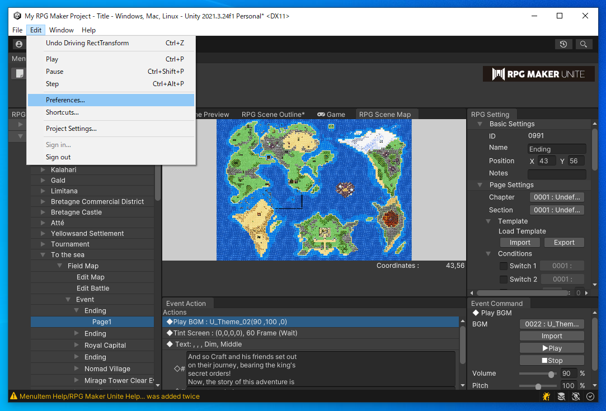
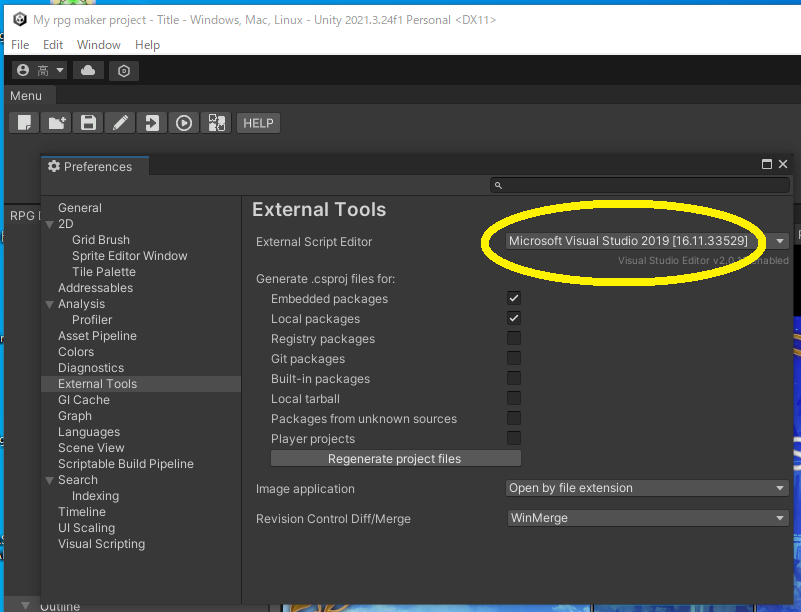
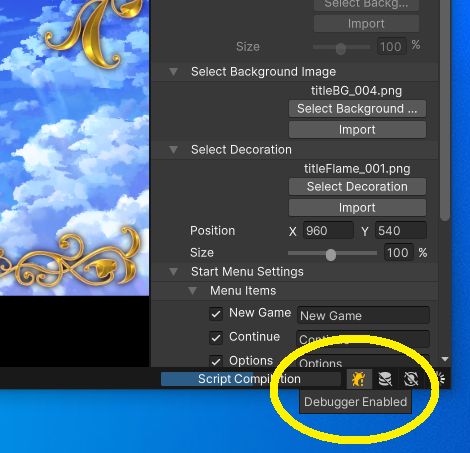
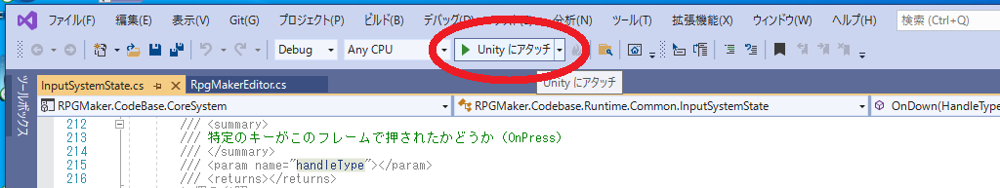
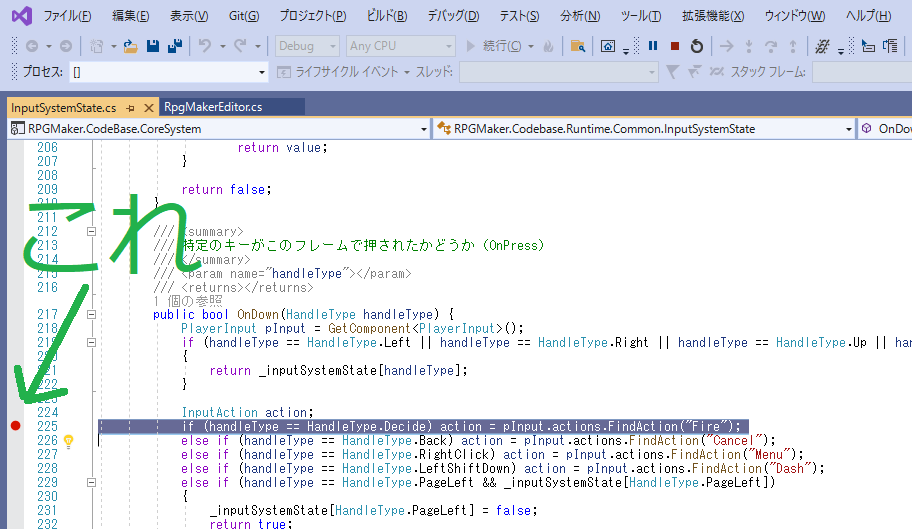
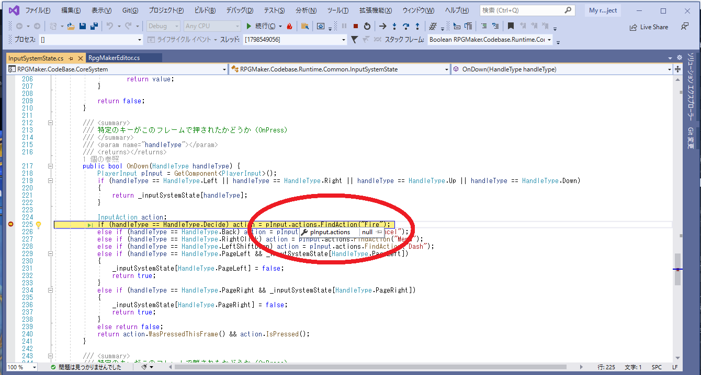

# Visual Studio の設定

## Visual Studio Tools for Unity をインストールする

Visual Studio Installer を開く  

  

参考 📖 [Unity での C# コードのデバッグ](https://docs.unity3d.com/ja/2020.3/Manual/ManagedCodeDebugging.html)  

次は、 Unity Editor を開く  

  

👆 `[Edit] - [Preferences...]` をクリック  

  

👆 Unity Editor の方でも設定する  

## デバッガーの設定

  

👆 Unity Editor の右下に、デバッグ・モードに切り替えるボタンがあるので、デバッグ・モードを有効にする  

  

👆 Visual Studio の方で、`Unity にアタッチ` を実行する  

  

👆 ブレーク・ポイントを置くなり、さまざまなデバッグ技法を使う  

あとは　ふつうにゲームを再生する  

  

👆 デバッガーが使えている  
