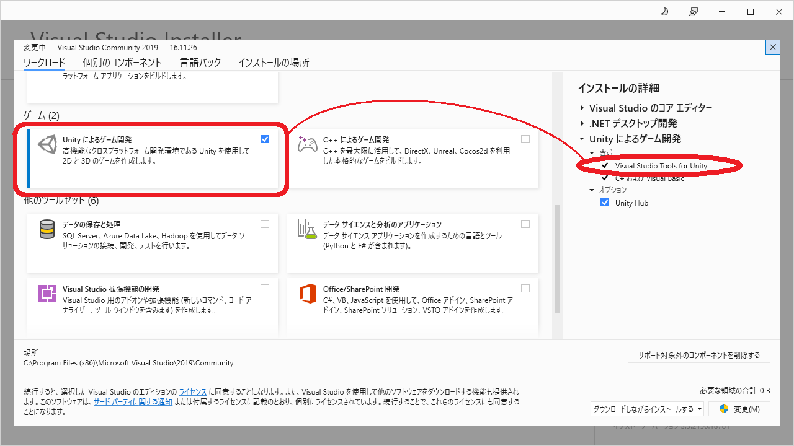
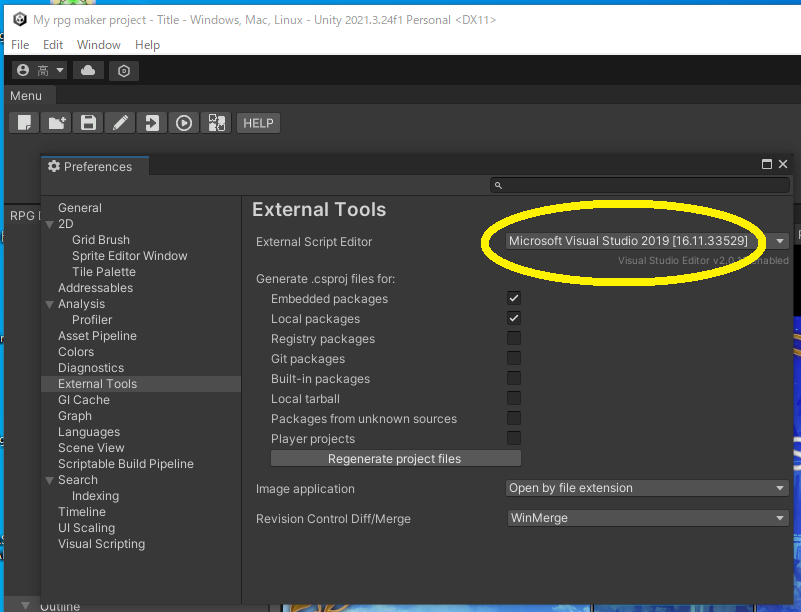

# Visual Studio の設定

## Visual Studio Tools for Unity をインストールする

  

参考 📖 [Unity での C# コードのデバッグ](https://docs.unity3d.com/ja/2020.3/Manual/ManagedCodeDebugging.html)  

  

👆 Unity Editor の方でも設定する  

  

👆 Unity Editor の右下に、デバッグ・モードに切り替えるボタンがあるので、デバッグ・モードを有効にする  
